---
# try also 'default' to start simple
theme: seriph
# random image from a curated Unsplash collection by Anthony
# like them? see https://unsplash.com/collections/94734566/slidev
background: https://source.unsplash.com/collection/94734566/1920x1080
# apply any windi css classes to the current slide
class: 'text-center'
# https://sli.dev/custom/highlighters.html
highlighter: shiki
# show line numbers in code blocks
lineNumbers: false
# some information about the slides, markdown enabled
info: |
  ## Slidev Starter Template
  Presentation slides for developers.

  Learn more at [Sli.dev](https://sli.dev)
# persist drawings in exports and build
drawings:
  persist: false
---

# Verify merge sort in Agda and Coq


---

# Prove Merge Sort

- Defination
  - sorted, ≤, split, ( ★ ☆ ☆ ☆ ☆ )
  - merge ( ★ ★ ★ ★ ☆ )
    - multi definition in Agda and Coq
- Prove the output is sorted ( ★ ★ ★ ★ ☆ )
  - 2 approaches
- Prove the output is permutation of input ( ★ ☆ ☆ ☆ ☆ )
  - 1 approach
- Time complexity O(log n) ( ★ ★ ★ ★ ★ )

---

# Part1 : Prepare to sorted


---

# Part2 : Sorted


---

# Part3 : Permutation

---

# List 
```
data List {a} (A : Set a) : Set a where
  []  : List A
  _∷_ : (x : A) (xs : List A) → List A
```

---

# ≤

```
data _≤_ : ℕ  -> ℕ -> Set where
  ≤-reflex : {n : ℕ } -> n ≤ n
  s≤s : {n m : ℕ } -> ( n ≤ m ) -> ( n  ≤  suc m )
```

```
zero≤n : ( n : ℕ )  -> zero ≤ n
zero≤n zero = ≤-reflex
zero≤n (suc n) = s≤s (zero≤n n)
```

```
transitive : { n m o : ℕ } -> n ≤ m -> m ≤ o -> n ≤ o
transitive {n} {.n} {o} ≤-reflex x₁ = x₁
transitive {n} {.(suc _)} {.(suc _)} (s≤s x) ≤-reflex = s≤s x
transitive {n} {.(suc _)} {.(suc _)} (s≤s x) (s≤s x₁) = s≤s (transitive x (transitive (s≤s ≤-reflex) x₁))
```

---

# ≤

```
em : ( m n : ℕ ) -> ( m ≤ n ) ⊎ ( n ≤ m )
em zero n = inj₁ (zero≤n n)
em (suc m) zero = inj₂ (zero≤n (suc m))
em (suc m) (suc n) with em m n
em (suc m) (suc n) | inj₁ x = inj₁ (sucsuc _ _ x)
em (suc m) (suc n) | inj₂ y = inj₂ (sucsuc _ _ y)
```

---

# list is sorted

```
data sorted : List ℕ -> Set where
  nil : sorted []
  one : {x : ℕ } -> sorted ( x ∷ [] )
  two : (x y : ℕ ) -> (L : List ℕ ) -> x ≤ y -> sorted ( y ∷ L ) -> sorted ( x ∷ y ∷ L ) 
   
```

---

# Question

1. 如果第一步展开错了怎么办？

  <br/>

2. 如果没有发现 coqlemma 怎么办？

  <br/>

3. with 的含义

---

# Question

1. 如果第一步展开错了怎么办？

  依然可以证明出来

  <br/>

2. 如果没有发现 coqlemma 怎么办？

  可能不得不引入一些复杂的引理（mutual）

  <br/>

3. with 的含义

  mutual 的语法糖

---

# Termination

众所周知，函数是否可以停机是很难判断的

递归的函数，终止性是很难判断的

agda 要求函数必须可以终止

- 单个函数的 termination
  - 一个参数
  - 二个参数
- mutual 函数的 termination
  - mutual 终止的复杂性
  - 一种可终止的模式

---

# 单个函数的termination

```
{- - -}
foo : ℕ ->  ℕ
foo x = foo x
```

```
{- ↑ -}
foo : ℕ ->  ℕ
foo x = foo (suc x)
```

```
{- ↓ -}
fib : ℕ ->  ℕ
fib zero = one
fib (suc zero) = one
fib (suc (suc x)) = fib x + fib (suc x)
```

--- 

# Observation

递归函数能终止，必须有参数下降 (5 种情况)

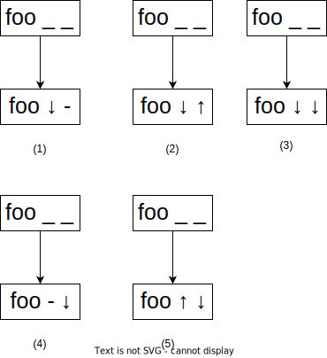


--- 

# 2 arguments

显然，如果有多个参数，也必须有至少一个参数下降

```
foo: ℕ -> ℕ ->  ℕ
foo x y = foo (suc x) y
```

--- 

如果发生两种递归，那只有 C(5, 2) = 10 种情况

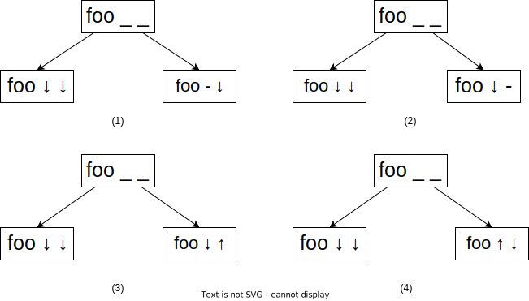

---

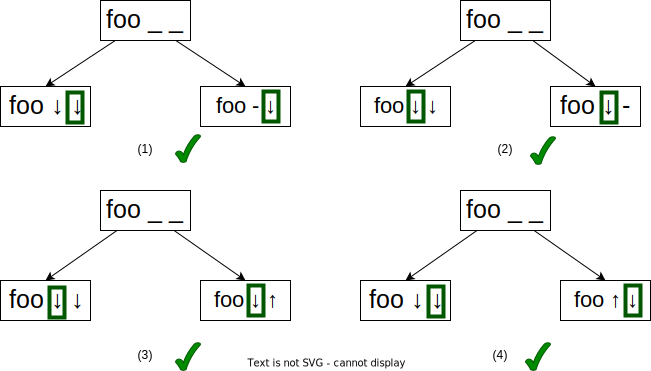

Obversation: 所有的递归，固定一个参数下降，函数可以终止

---

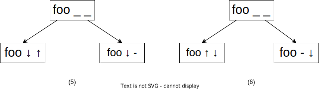

---

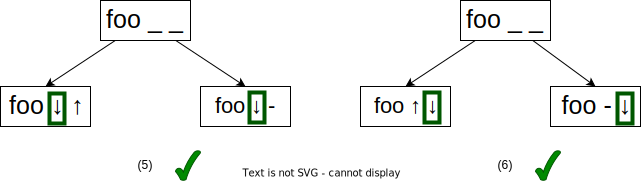

<br/>

Obversation: 所有的递归，固定一个参数下降，函数可以终止

---

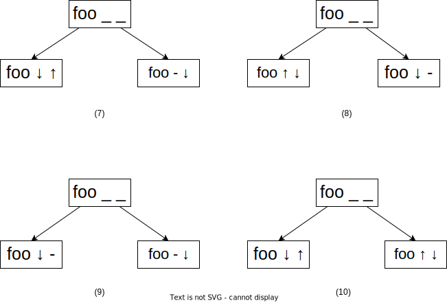

---


---

# Counter example of (10)


<div grid="~ cols-2 gap-4">
<div>

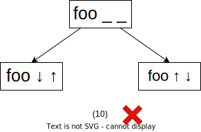

</div>
<div>

```
foo : ℕ -> ℕ -> ℕ
foo zero y = zero
foo (suc x) zero = zero
foo (suc x) (suc y) = foo x (suc (suc y))
                    + foo (suc (suc x)) y
```

</div>
</div>


<div grid="~ cols-2 gap-4">
<div>

每次递归满足以下任意条件，函数可以终止：
- 参数A下降
- 参数A不变，参数B下降

A B 可能有多种选择

</div>

<div>
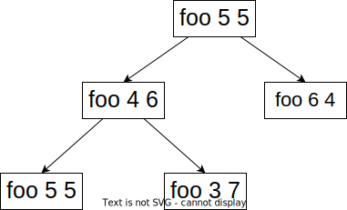
</div>
</div>

---

# 单个函数终止性总结

必须满足以下两种条件之一

1. 每次递归，固定一个参数A下降

2. 每次递归，必须是以下两种可能

  - 参数 A 下降
  - 参数 A 不变，参数 B 下降

---

# Termination example : ackermann

<div grid="~ cols-2 gap-4">
<div>

</div>

<div>

```
ackermann : ℕ -> ℕ -> ℕ
ackermann zero y = suc y
ackermann (suc x) zero = ackermann x (suc zero)
ackermann (suc x) (suc y) = 
              ackermann x (ackermann (suc x) y)
```

</div>
</div>

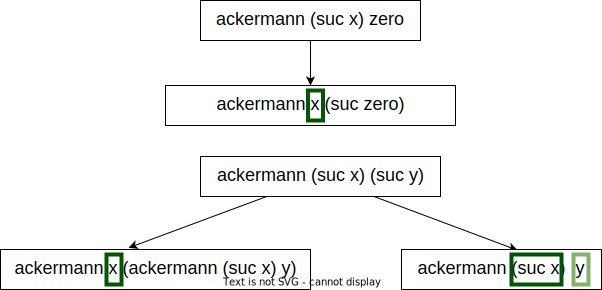

---

# Complexitivy of termination in mutual

就算存在不下降的递归，也有可能终止

```
{- agda hello.agda --termination-depth=3 -}
mutual
  foo : List ℕ -> List ℕ
  foo [] = []
  foo (x ∷ []) = []
  foo (x ∷ x₁ ∷ x₂) = bar x₂

  bar :  List ℕ -> List ℕ
  bar x = foo (zero ∷ x)
```

---

# Coq's approach

---


<!--

# Different way to prove sorted

<style type="text/css">
.tg  {border-collapse:collapse;border-spacing:0;}
.tg td{border-color:black;border-style:solid;border-width:1px;font-family:Arial, sans-serif;font-size:14px;
  overflow:hidden;padding:10px 5px;word-break:normal;}
.tg th{border-color:black;border-style:solid;border-width:1px;font-family:Arial, sans-serif;font-size:14px;
  font-weight:normal;overflow:hidden;padding:10px 5px;word-break:normal;}
.tg .tg-0lax{text-align:left;vertical-align:top}
</style>
<table class="tg">
<thead>
  <tr>
    <th class="tg-0lax"></th>
    <th class="tg-0lax">Agda<br></th>
    <th class="tg-0lax">Coq</th>
  </tr>
</thead>
<tbody>
  <tr>
    <td class="tg-0lax">structure<br>induction<br></td>
    <td class="tg-0lax">★★☆☆☆</td>
    <td class="tg-0lax">★★★★☆</td>
  </tr>
  <tr>
    <td class="tg-0lax">length<br>induction<br></td>
    <td class="tg-0lax">★★☆☆☆</td>
    <td class="tg-0lax">★★☆☆☆</td>
  </tr>
</tbody>
</table>

-->

---

# 失败的证明路线

- `merge xs ys = merge ys xs`

---

# Summary

<table style="border-collapse:collapse;border-spacing:0" class="tg"><thead><tr><th style="border-color:#000000;border-style:solid;border-width:1px;font-family:Arial, sans-serif;font-size:14px;font-weight:normal;overflow:hidden;padding:10px 5px;text-align:left;vertical-align:top;word-break:normal"></th><th style="border-color:#000000;border-style:solid;border-width:1px;font-family:Arial, sans-serif;font-size:14px;font-weight:normal;overflow:hidden;padding:10px 5px;text-align:left;vertical-align:top;word-break:normal"></th><th style="border-color:#000000;border-style:solid;border-width:1px;font-family:Arial, sans-serif;font-size:14px;font-weight:normal;overflow:hidden;padding:10px 5px;text-align:center;vertical-align:top;word-break:normal" colspan="2"><span style="font-weight:normal">Agda</span></th><th style="border-color:#000000;border-style:solid;border-width:1px;font-family:Arial, sans-serif;font-size:14px;font-weight:normal;overflow:hidden;padding:10px 5px;text-align:center;vertical-align:top;word-break:normal" colspan="2"><span style="font-weight:normal">Coq</span></th></tr></thead><tbody><tr><td style="border-color:#000000;border-style:solid;border-width:1px;font-family:Arial, sans-serif;font-size:14px;overflow:hidden;padding:10px 5px;text-align:left;vertical-align:top;word-break:normal"></td><td style="border-color:#000000;border-style:solid;border-width:1px;font-family:Arial, sans-serif;font-size:14px;overflow:hidden;padding:10px 5px;text-align:left;vertical-align:top;word-break:normal">definition of merge</td><td style="border-color:#000000;border-style:solid;border-width:1px;font-family:Arial, sans-serif;font-size:14px;overflow:hidden;padding:10px 5px;text-align:center;vertical-align:top;word-break:normal">`with`</td><td style="border-color:#000000;border-style:solid;border-width:1px;font-family:Arial, sans-serif;font-size:14px;overflow:hidden;padding:10px 5px;text-align:center;vertical-align:top;word-break:normal">mutual define</td><td style="border-color:#000000;border-style:solid;border-width:1px;font-family:Arial, sans-serif;font-size:14px;overflow:hidden;padding:10px 5px;text-align:center;vertical-align:top;word-break:normal">`Fixpoint`</td><td style="border-color:#000000;border-style:solid;border-width:1px;font-family:Arial, sans-serif;font-size:14px;overflow:hidden;padding:10px 5px;text-align:center;vertical-align:top;word-break:normal">`Function`</td></tr><tr><td style="border-color:#000000;border-style:solid;border-width:1px;font-family:Arial, sans-serif;font-size:14px;overflow:hidden;padding:10px 5px;text-align:left;vertical-align:top;word-break:normal" rowspan="3">structural<br>recursion</td><td style="border-color:#000000;border-style:solid;border-width:1px;font-family:Arial, sans-serif;font-size:14px;overflow:hidden;padding:10px 5px;text-align:left;vertical-align:top;word-break:normal">nested recursion</td><td style="border-color:#000000;border-style:solid;border-width:1px;font-family:Arial, sans-serif;font-size:14px;overflow:hidden;padding:10px 5px;text-align:center;vertical-align:top;word-break:normal">𐄂</td><td style="border-color:#000000;border-style:solid;border-width:1px;font-family:Arial, sans-serif;font-size:14px;overflow:hidden;padding:10px 5px;text-align:center;vertical-align:top;word-break:normal">𐄂</td><td style="border-color:#000000;border-style:solid;border-width:1px;font-family:Arial, sans-serif;font-size:14px;overflow:hidden;padding:10px 5px;text-align:center;vertical-align:top;word-break:normal">✓</td><td style="border-color:#000000;border-style:solid;border-width:1px;font-family:Arial, sans-serif;font-size:14px;overflow:hidden;padding:10px 5px;text-align:center;vertical-align:top;word-break:normal">-</td></tr><tr><td style="border-color:#000000;border-style:solid;border-width:1px;font-family:Arial, sans-serif;font-size:14px;overflow:hidden;padding:10px 5px;text-align:left;vertical-align:top;word-break:normal">mutual recursion</td><td style="border-color:#000000;border-style:solid;border-width:1px;font-family:Arial, sans-serif;font-size:14px;overflow:hidden;padding:10px 5px;text-align:center;vertical-align:top;word-break:normal">single-mutual</td><td style="border-color:#000000;border-style:solid;border-width:1px;font-family:Arial, sans-serif;font-size:14px;overflow:hidden;padding:10px 5px;text-align:center;vertical-align:top;word-break:normal">mutual-mutual</td><td style="border-color:#000000;border-style:solid;border-width:1px;font-family:Arial, sans-serif;font-size:14px;overflow:hidden;padding:10px 5px;text-align:center;vertical-align:top;word-break:normal">𐄂</td><td style="border-color:#000000;border-style:solid;border-width:1px;font-family:Arial, sans-serif;font-size:14px;overflow:hidden;padding:10px 5px;text-align:center;vertical-align:top;word-break:normal"><span style="font-weight:400;font-style:normal">𐄂</span></td></tr><tr><td style="border-color:#000000;border-style:solid;border-width:1px;font-family:Arial, sans-serif;font-size:14px;overflow:hidden;padding:10px 5px;text-align:left;vertical-align:top;word-break:normal">other tactic</td><td style="border-color:#000000;border-style:solid;border-width:1px;font-family:Arial, sans-serif;font-size:14px;overflow:hidden;padding:10px 5px;text-align:center;vertical-align:top;word-break:normal">with</td><td style="border-color:#000000;border-style:solid;border-width:1px;font-family:Arial, sans-serif;font-size:14px;overflow:hidden;padding:10px 5px;text-align:center;vertical-align:top;word-break:normal">𐄂</td><td style="border-color:#000000;border-style:solid;border-width:1px;font-family:Arial, sans-serif;font-size:14px;overflow:hidden;padding:10px 5px;text-align:center;vertical-align:top;word-break:normal">𐄂</td><td style="border-color:#000000;border-style:solid;border-width:1px;font-family:Arial, sans-serif;font-size:14px;overflow:hidden;padding:10px 5px;text-align:center;vertical-align:top;word-break:normal">functional induction</td></tr><tr><td style="border-color:#000000;border-style:solid;border-width:1px;font-family:Arial, sans-serif;font-size:14px;overflow:hidden;padding:10px 5px;text-align:left;vertical-align:top;word-break:normal">length <br>recursion</td><td style="border-color:#000000;border-style:solid;border-width:1px;font-family:Arial, sans-serif;font-size:14px;overflow:hidden;padding:10px 5px;text-align:left;vertical-align:top;word-break:normal">length xs + length ys</td><td style="border-color:#000000;border-style:solid;border-width:1px;font-family:Arial, sans-serif;font-size:14px;overflow:hidden;padding:10px 5px;text-align:center;vertical-align:top;word-break:normal">length-decrease</td><td style="border-color:#000000;border-style:solid;border-width:1px;font-family:Arial, sans-serif;font-size:14px;overflow:hidden;padding:10px 5px;text-align:center;vertical-align:top;word-break:normal">mutual-length-decrease</td><td style="border-color:#000000;border-style:solid;border-width:1px;font-family:Arial, sans-serif;font-size:14px;overflow:hidden;padding:10px 5px;text-align:center;vertical-align:top;word-break:normal">✓</td><td style="border-color:#000000;border-style:solid;border-width:1px;font-family:Arial, sans-serif;font-size:14px;overflow:hidden;padding:10px 5px;text-align:center;vertical-align:top;word-break:normal">-</td></tr></tbody></table>
---

# Future work

1. 验证mergesort时间复杂度 O(log n)
2. Coq 中mutual induction，证明lemma3 lemma4

--- 

# Induction

1. induction 分显式的induction 和隐式的induction
2. coq 是显式的induction。 Agda是隐式的induction

<br/>

## 什么时候要 induction

<br/>

1. 可以随便induction（大不了不用induction引入的条件）

---

# Summary

- Agda 可以写通用程序
- Agda 与普通编程语言一个显著的不同是要求函数的可终止性
- 证明可终止性可以利用定义的induction，或者性质（长度）的下降
- Agda 的termination checker 比 Coq 的智能
- Agda 中 尽量使用 with 。 mutual 会给后续的证明带来不便
- Agda 的自动补全失效时，可以手工加上隐藏参数，帮助Agda推导

---

# Reference

[--termination-depth=N](https://wiki.portal.chalmers.se/agda/ReferenceManual/Pragmas)

[software foudation](https://softwarefoundations.cis.upenn.edu/vfa-current/index.html)

[`Function` in Coq](https://github.com/gtanzer/sort)
