---
# try also 'default' to start simple
theme: default
# random image from a curated Unsplash collection by Anthony
# like them? see https://unsplash.com/collections/94734566/slidev
background: https://source.unsplash.com/collection/94734566/1920x1080
# apply any windi css classes to the current slide
class: 'text-center'
# https://sli.dev/custom/highlighters.html
highlighter: shiki
# show line numbers in code blocks
lineNumbers: false
# some information about the slides, markdown enabled
info: |
  ## Slidev Starter Template
  Presentation slides for developers.

  Learn more at [Sli.dev](https://sli.dev)
# persist drawings in exports and build
drawings:
  persist: false
---

# Use VST to prove mergesort


---

<div grid="~ cols-2 gap-4">
<div>

```c
void c_mergesort(unsigned *arr, int len) {
  if (len == 1) { return; }

  int p = len/2;
  unsigned *arr1 = arr;
  unsigned *arr2 = arr+p;

  c_mergesort(arr1, p);
  c_mergesort(arr2, len-p);

  unsigned *t = malloc(sizeof(unsigned)*len);
  if(!t){exit(1);}

  int i=0; int j=p; int k=0;

  for(; i< p && j < len ; k++){
    if(arr[i]<=arr[j]){
      t[k]=arr[i];
      i++;
    }else{
      t[k]=arr[j];
      j++;
    }
  }
```

</div>
<div>

```c
  for(;i<p ; i++, k++){
    t[k]=arr[i];
  }
  for(;j<len ; j++, k++){
    t[k]=arr[j];
  }

  memcpy(arr, t, sizeof(unsigned)*len);
  free(t);
}
```

</div>

</div>

<!--
我用下标写的
减少对指针的使用
-->

---



---

```
Definition c_mergesort_spec : ident * funspec :=
 DECLARE _c_mergesort
 WITH p: val,  sh : share, il: list Z, gv: globals
 PRE [ tptr tuint , tint ]
    PROP ( writable_share sh;
           0 < Zlength il <= Int.max_signed;
           Forall (fun x => 0 <= x <= Int.max_unsigned) il)
    PARAMS (p; Vint (Int.repr (Zlength il)) )
    GLOBALS(gv)
    SEP (data_at sh (tarray tuint (Zlength il)) (map Vint (map Int.repr il)) p;
         mem_mgr gv)

 POST [ tvoid ]
    PROP ( ) RETURN ()
    SEP (data_at sh (tarray tuint (Zlength il)) (map Vint (map Int.repr (mergesort il))) p;
         mem_mgr gv).
```

---

<div class="half">

```c
void c_mergesort(unsigned *arr, int len) {
  ...
}
```

</div>


<div class="pre">

```c {all|7}
PROP ( writable_share sh;
       0 < Zlength il <= Int.max_signed;
       Forall (fun x => 0 <= x <= Int.max_unsigned) il)
PARAMS (arr; Vint (Int.repr (Zlength il)) )
GLOBALS(gv)
SEP (
   data_at sh (tarray tuint (Zlength il)) il arr;
   mem_mgr gv)
```

</div>


<div class="post">

```c {all|3}
PROP ( ) RETURN ()
SEP (
  data_at sh (tarray tuint (Zlength il)) (mergesort il) arr;
  mem_mgr gv).
```

</div>


<style>
.half{
  position: absolute;
  top: 190px;
  width: 35%
}
.pre{
  position: absolute;
  top: 20px;
  right:100px;
  border: double;
  width : 470px;
}
.post{
  position: absolute;
  bottom: 170px;
  right:100px;
  border: double;
  width : 470px;
}
</style>

---

<div class="half" >

```c {all|8-9|16-30}
void c_mergesort(unsigned *arr, int len) {
  if (len == 1) { return; }

  int p = len/2;
  unsigned *arr1 = arr;
  unsigned *arr2 = arr+p;

  c_mergesort(arr1, p);
  c_mergesort(arr2, len-p);

  unsigned *t = malloc(sizeof(unsigned)*len);
  if(!t){exit(1);}

  int i=0; int j=p; int k=0;

  for(; i< p && j < len ; k++){
    if(arr[i]<=arr[j]){
      t[k]=arr[i];
      i++;
    }else{
      t[k]=arr[j];
      j++;
    }
  }
 ... 


```

<arrow v-click="1" x1="430" y1="135" x2="230" y2="170" color="#564" width="2" arrowSize="5" />

</div>

<div v-click="1" class="sep1">

```
// il : List Z
SEP (data_at sh (tarray tuint (Zlength il)) il arr )
```

</div>

<arrow v-click="1" x1="430" y1="255" x2="230" y2="220" color="#564" width="2" arrowSize="5" />

<div v-click="1" class="sep2" >

```
SEP (data_at sh (tarray tuint (Zlength il)) (l1 ++ l2) arr)
// l1 = mergesort (firstn p il)
// l2 = mergesort (skipn p il)
```

</div>

<arrow v-click="2" x1="430" y1="400" x2="230" y2="400" color="#564" width="2" arrowSize="5" />

<div v-click="2" class="sep3">

```
// loop invariant
firstn (i + j - p) (merge l1 l2) = 
  merge (firstn i l1) (firstn (j - p) l2)

SEP (data_at sh (tarray tuint (Zlength il)) 
      firstn (i + j - p) (merge l1 l2) t)
```

</div>

<arrow v-click="2" x1="430" y1="500" x2="87" y2="475" color="#564" width="2" arrowSize="5" />

<div v-click="2" class="sep4">

```
// after loop
i = p \/ j = len
```

</div>

<style>
.half{
  width: 40%
}
.sep1{
  position: absolute;
  top: 120px;
  right:90px;
  border: double;
  width : 470px;
}
.sep2{
  position: absolute;
  bottom: 250px;
  right: 90px;
  border: double;
  width : 470px;
}
.sep3{
  position: absolute;
  bottom: 80px;
  right: 90px;
  border: double;
  width : 470px;
}
.sep4{
  position: absolute;
  bottom: 15px;
  right: 90px;
  border: double;
  width : 470px;
}
</style>

---

## (1) i = p

<div class="half" >

```c
  for(;i<p ; i++, k++){
    t[k]=arr[i];
  }

  for(;j<len ; j++, k++){
    t[k]=arr[j];
  }


  memcpy(arr, t, sizeof(unsigned)*len);


  free(t);
}
```

</div>

<div v-click="1" class="dotted-triangle"> </div>

<arrow v-click="1" x1="420" y1="120" x2="280" y2="120" color="#564" width="2" arrowSize="5" />

<div v-click="1" class="sep1" >  
Nothing happens<br>
because i = p
</div>

<arrow v-click="2" x1="430" y1="220" x2="230" y2="190" color="#564" width="2" arrowSize="5" />

<div v-click="2" class="sep2">

```
// loop invariant
firstn j (merge l1 l2) = 
  merge l1 (firstn (j - p) l2)

SEP (data_at sh (tarray tuint (Zlength il)) 
      (firstn j (merge l1 l2)) t)
```

</div>

<arrow v-click="3" x1="430" y1="340" x2="90" y2="210" color="#564" width="2" arrowSize="5" />

<div v-click="3" class="sep3">

```
// after loop
j = len; k = len
SEP (data_at sh (tarray tuint (Zlength il)) (merge l1 l2) t)
```

</div>

<arrow v-click="4" x1="430" y1="440" x2="230" y2="440" color="#564" width="2" arrowSize="5" />

<div v-click="4" class="sep4">

```
// before memcpy
SEP (data_at sh (tarray tuint (Zlength il)) (merge l1 l2) t)
```

</div>

<arrow v-click="4" x1="430" y1="485" x2="230" y2="485" color="#564" width="2" arrowSize="5" />

<div v-click="4" class="sep5">

```
// after memcpy
SEP (data_at sh (tarray tuint (Zlength il)) (merge l1 l2) t)
SEP (data_at sh (tarray tuint (Zlength il)) (merge l1 l2) arr)
```

</div>

<style>
.half{
  width: 40%
}
.sep1{
  position: absolute;
  top: 103px;
  right:90px;
  width : 470px;
}
.sep2{
  position: absolute;
  bottom: 260px;
  right: 90px;
  border: double;
  width : 470px;
}
.sep3{
  position: absolute;
  bottom: 165px;
  right: 90px;
  border: double;
  width : 470px;
}
.sep4{
  position: absolute;
  bottom: 89px;
  right: 90px;
  border: double;
  width : 470px;
}
.sep5{
  position: absolute;
  bottom: 4px;
  right: 90px;
  border: double;
  width : 470px;
}
.dotted-triangle{
  background: transparent;
  border: dotted;
  position: absolute;
  top: 80px;
  left: 70px;
  width:200px;
  height:70px;
}
</style>

---

## (2) j = len

<div class="half" >

```c
  for(;i<p ; i++, k++){
    t[k]=arr[i];
  }


  for(;j<len ; j++, k++){
    t[k]=arr[j];
  }


  memcpy(arr, t, sizeof(unsigned)*len);
  

  free(t);
}
```
</div>


<arrow v-click="1" x1="420" y1="115" x2="200" y2="115" color="#564" width="2" arrowSize="5" />

<div v-click="1" class="sep1">

```
// loop invariant
firstn (i + len - p) (merge l1 l2) = 
  merge (firstn i l1) l2

SEP (data_at sh (tarray tuint (Zlength il)) 
      firstn (i + len - p) (merge l1 l2) t )
```

</div>

<arrow v-click="2" x1="430" y1="220" x2="90" y2="140" color="#564" width="2" arrowSize="5" />

<div v-click="2" class="sep2">

```
// after loop
i = p; k = len
SEP (data_at sh (tarray tuint (Zlength il)) (merge l1 l2) t)
```

</div>

<arrow v-click="3" x1="420" y1="355" x2="270" y2="355" color="#564" width="2" arrowSize="5" />

<div v-click="3" class="dotted-triangle"> </div>

<div v-click="3" class="sep3" >  
Nothing happens<br>
because j = len
</div>


<arrow v-click="4" x1="430" y1="430" x2="230" y2="430" color="#564" width="2" arrowSize="5" />

<div v-click="4" class="sep4">

```
// before memcpy
SEP (data_at sh (tarray tuint (Zlength il)) (merge l1 l2) t)
```

</div>

<arrow v-click="4" x1="430" y1="510" x2="230" y2="480" color="#564" width="2" arrowSize="5" />

<div v-click="4" class="sep5">

```
// after memcpy
SEP (data_at sh (tarray tuint (Zlength il)) (merge l1 l2) t)
SEP (data_at sh (tarray tuint (Zlength il)) (merge l1 l2) arr)
```

</div>

<style>
.half{
  width: 40%
}
.sep1{
  position: absolute;
  top: 60px;
  right:90px;
  border: double;
  width : 470px;
}
.sep2{
  position: absolute;
  bottom: 270px;
  right: 90px;
  border: double;
  width : 470px;
}
.sep3{
  position: absolute;
  bottom: 180px;
  right: 87px;
  width : 470px;
}
.sep4{
  position: absolute;
  bottom: 97px;
  right: 90px;
  border: double;
  width : 470px;
}
.sep5{
  position: absolute;
  bottom: 7px;
  right: 90px;
  border: double;
  width : 470px;
}
.dotted-triangle{
  background: transparent;
  border: dotted;
  position: absolute;
  bottom: 170px;
  left: 70px;
  width:200px;
  height:70px;
}
</style>

---

## loop invariant

```
merge (firstn i l1) (firstn j l2) = firstn (i + j) (merge l1 l2)
l1[i] <= l2[j]
-------------------------------------------------------------------------
merge (firstn (i+1) l1) (firstn j l2) = firstn (i + 1 + j) (merge l1 l2)
```

---

## loop invariant

```
merge (firstn i l1) (firstn j l2) = firstn (i + j) (merge l1 l2)
l1[i] <= l2[j]
------------------------------------------------------------------------------------------------------------
merge (firstn (i+1) l1) (firstn j l2)       =    firstn (i + 1 + j) (merge l1 l2)
                 ||                                                      ||
merge (firstn i l1) (firstn j l2) + l1[i]                            merge (firstn i l1) (firstn j l2) ++
                                                                     merge (skipn i l1) (skipn j l2)
           Lemma2 + Lemma1                                                       Lemma1
```

<br>
<div v-click="1">

```
// Lemma1, proven by induction on (length l1 + length l2)
merge (firstn i l1) (firstn j l2) = firstn (i + j) (merge l1 l2)
----------------------------------------------------------------------------------
merge (firstn i l1) (firstn j l2) ++ merge (skipn i l1) (skipn j l2) = merge l1 l2 
```

</div>
<br>
<div v-click="2">

```
// Lemma2, proven by induction on (length l1 + length l2)
merge (firstn i l1) (firstn j l2) = firstn (i + j) (merge l1 l2)
-------------------------------------------------------------------------------------------
merge (firstn i l1) (firstn j l2) = firstn (i + j) (merge (firstn (i+1) l1) (firstn j l2))
```
</div>

---

# Q&A

1. 相同的逻辑，证明的难度会不同？

比如使用指针比较越界？

倒逼要写适合证明的c程序？

---

# Conclusion

1. 所有关于merge的lemma，都用总长度做induction


